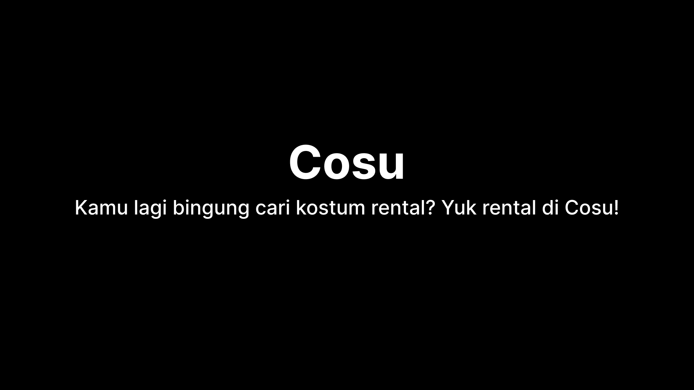

  <h1>Cosu</h1>
  
Kamu lagi bingung cari kostum rental? Yuk rental di Cosu!

## Idea

The idea of this project comes from my hobby, which is photography. In this case, i quite often take some photos of Cosplayer at an event. And based on my observation, only few costume rental shop on my city(Pangkalpinang). And there is no costume rental shop that create or have a Website to sell/promote their services. Because of that, i thought it's a good idea to build a Costume Rental Shop Website for my final project.

## Key Features

- Costumes list.
- Order costume via Whatsapp chat. Only appear when user are already signed in. Order maximum per costume: 1.
- Sign Up, Sign In, and Sign Out.
- Dark mode for homepage.

## Project

This project are divided into two parts, Frontend and Backend. For Frontend side, i use HTML, CSS, Javascript. And in Backend side, i use Express JS and MySQL. According to the module that provided by GDSC UIN Syarif Hidayatullah Jakarta.

Here is the username and password for admin role:

- Username: baraya
- Password: baraya_123

Deployment link:

- Frontend: [here](https://cosu-6qh.pages.dev)
- Backend: [here](https://backend-cosu.vercel.app)

If you test the "add costume" feature and you want to insert the image, you must add your image that you want to `static` folder. For security purpose, i don't convert the images to base64 and store it to database. Instead, i use locale image path(like `./static/`).

## Screenshots

- Light Mode

  

  

  

  

- Dark Mode

  

  

  

  

- Dockerize backend app

  

- Railway data

  

- Demo

  

## Getting Started

- Install all dependencies that available in `be` folder with command `pnpm install`.
- Type `pnpm run dev` in terminal and see the result for Backend side in `http://localhost:5000`
- For Frontend side, make sure that you've already installed Go Live extension. See the result with Go Live extension.
